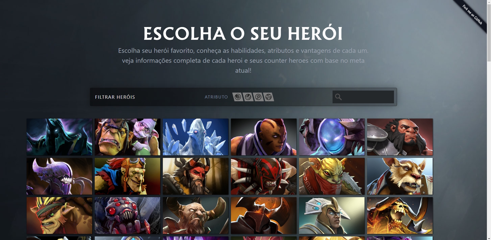
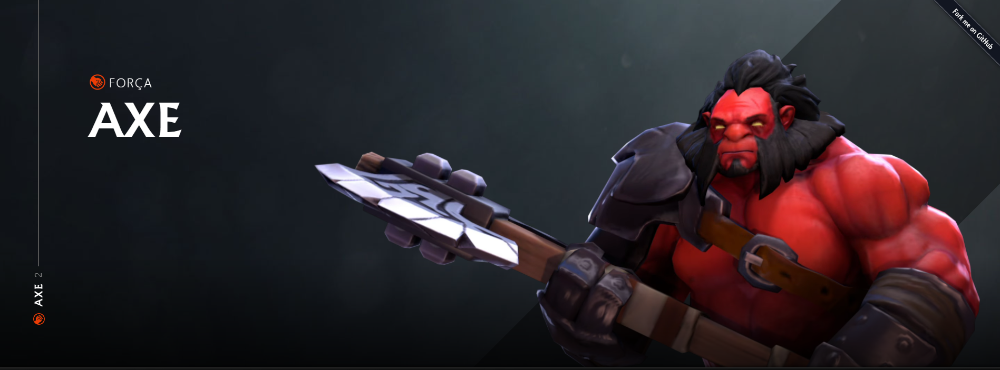
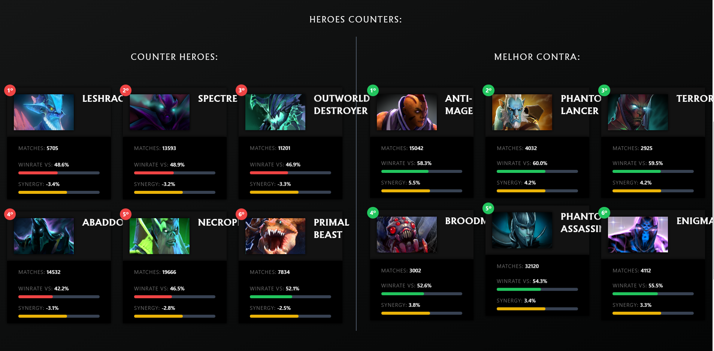
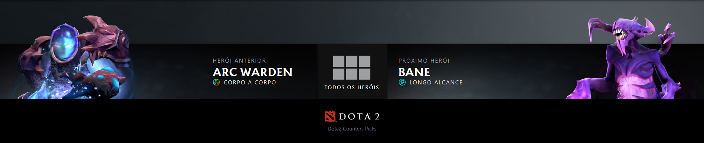

# DOTA 2 HEROES INFO

## 📃 About

📦 A simple website that will show information about counters picks and best heroes from hero

- [x] Get all meta heroes
- [x] Get specific hero
- [x] Show counters picks
- [x] Show best pick vs
- [ ] Transalation US, ESP

# WEBSITE

- HOME
  

- HERO PICK
  
  
  

### Features

- Get information from [STRATZ](https://stratz.com/)
  - Meta hero
  - Hero info

## Development

**Node.js 18 or newer is required.**

Install it locally in your project folder:

```bash
git clone https://github.com/GabrielCSTR/d2-heroes-info.git
cd ./d2-heroes-info
npm install
npm run dev
```

## 💰 Support

Not required but if you want... then by all means gib me ur cash please 💰 🔫

[](https://buymeacoffee.com/gabriel.dev/)

## 👷‍♂️ Creator

[](https://github.com/GabrielCSTR)

[](https://twitter.com/gbrl_str) [](https://twitch.tv/xstrdoto)

Made with 💖 and JavaScript!

## License

[MIT](https://github.com/GabrielCSTR/d2pt.js/blob/master/LICENSE)

_This project is not affiliated with [STRATZ](https://stratz.com/) in any way._
